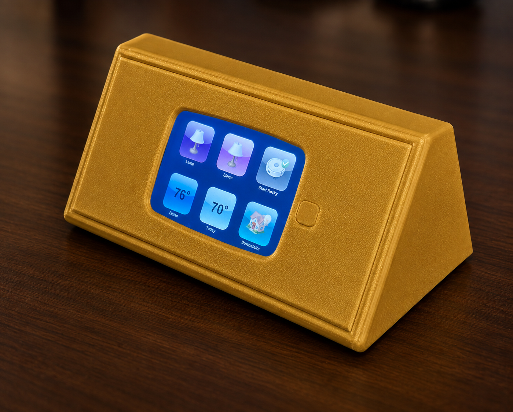
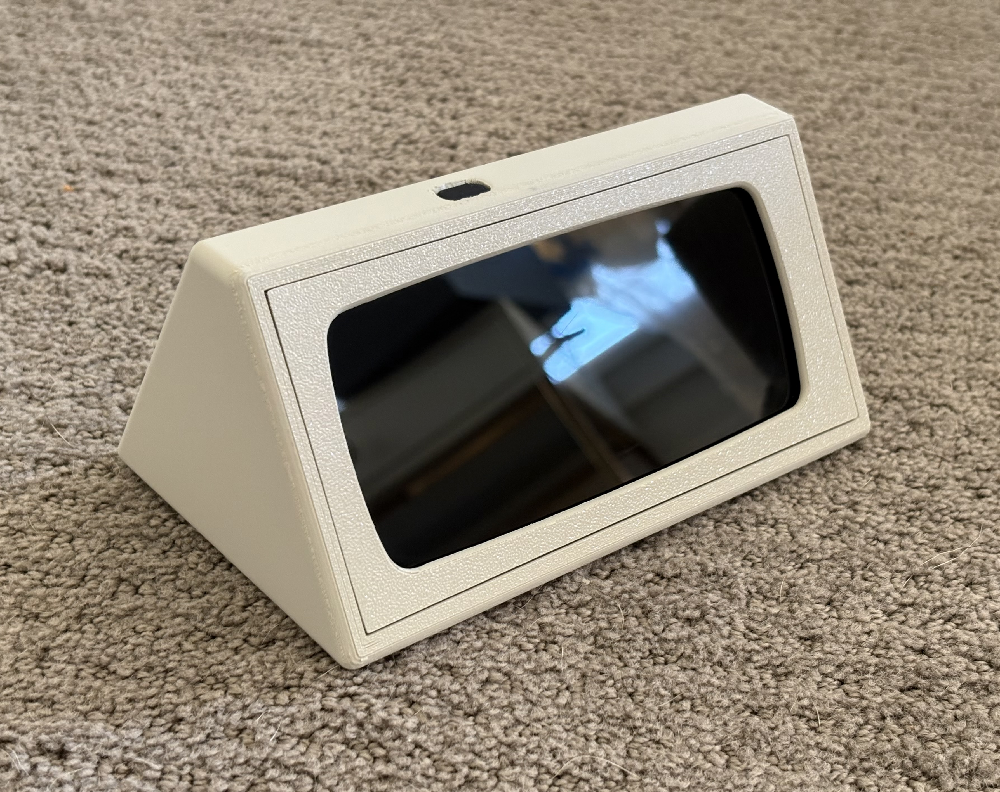
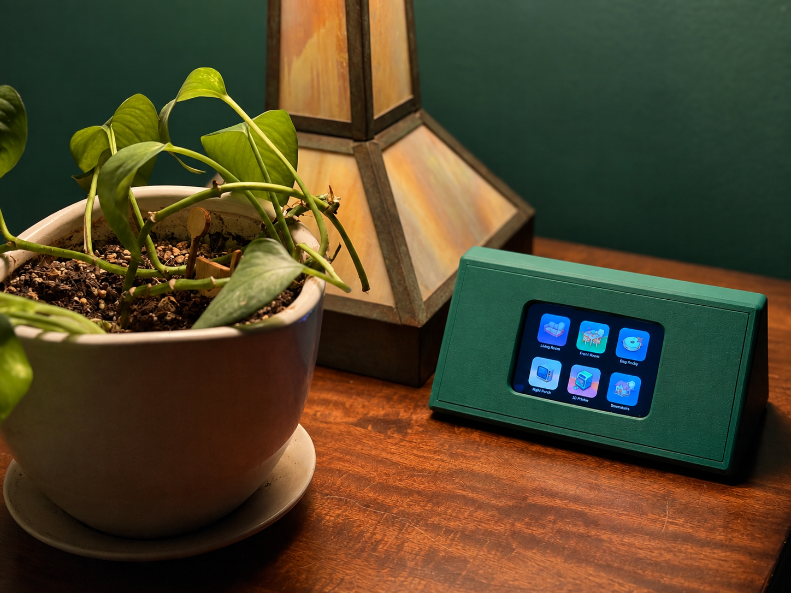
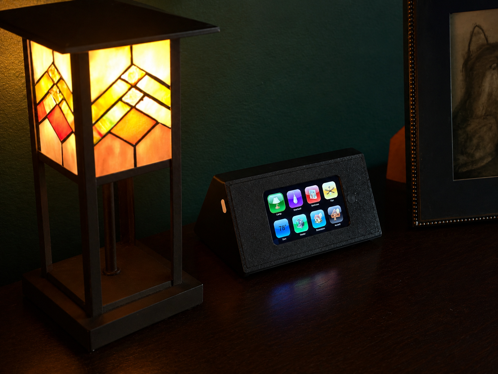

# iNgot

   
  <b>iNgot</b>

  <a href="#introduction">Introduction</a> •
  <a href="#gallery">Gallery</a> •
  <a href="#credits-and-license">Credits and License
</a>

   

### Introduction
**iNgot** is a project that transforms old touch screen devices into kiosk displays.  
Save these devices from the landfill, they're worth their weight in gold!

### Components
iNgot is comprised of three components:  
- Touch screen device: smart phone, tablet, etc. Any old device will do!
- Enclosure: A 3D printed enclosure.
- Software: A lightweight flask application, which controls [HomeAssistant](https://www.home-assistant.io/) entities.

### Hardware
#### Devices
I started this project because I wanted to put my old iPods and iPhones to use, rather then throwing them in the ewaste pile or letting them collect dust in a drawer.  
The main use case is simple kiosk display and controller for my HomeAssistant instance.  
By designging the enclosure and software to be compatible with legacy hardware, I can quickly and easily convert any old mobile device into a new iNgot. 

#### Enclosure
I designed the enclosure to be as compatible as possible with iPods and smart phones.  
The hardware consists of three parts:  
- The prism: A trapezoidal prism shaped block.  This is the same size and shape for all devices, aside from the positions of the buttons.
- The front: Front plate with a cut out for the screen
- The retainer: This piece sits in between the other two, and holds the device securely in place.  

The parts are kept together with screws and threaded inserts.

### Software
The software is a lightweight Flask application with a front end written to be compatible with a wide range of mobile browsers.  
The oldest device I have on hand is a first generation iPod touch (2007) so the CSS and Javascript are written with that in mind.  
iOS devices are notoriously more difficult to tweak than Android devices, but a mish mash of jailbreak tweaks and old school web design has been pretty successful in acheiving the project goals, with:
- Always-on display
- Auto-launch webpage on boot
- No lock screen
- Supression of notifications
- Up to date information (as "real time" as possible, given hardware/software limitations) 

### Other Features
iNgot has a USB C port, and a small custom cable inside hooks it up to the device.  
To assist in easy disassembly, iNogt has a big ol' hole in the back, which you can poke a stick through to push the device out. As much as I like a _big ol' hole for pokin'_ I may be able to eliminate this in future iterations.  
The buttons are also 3D printed, and need no additional parts.  

#### Why "iNgot"?
The name iNgot comes the [hunks of metal](https://en.wikipedia.org/wiki/Ingot) which are the same shape.  
This is also an homage to the "iDevice" naming scheme of the mid 00's.  

### Gallery

  

    
    Samsung a10e
  

  

    
    iPhone 4s
  

  

    
    iPhone 5
  

  

    
    iPod Touch
  

### Credits and License
Gold icons created by vectorsmarket15 - Flaticon.  
https://www.flaticon.com/free-icons/gold  
[MIT](https://opensource.org/licenses/MIT)
